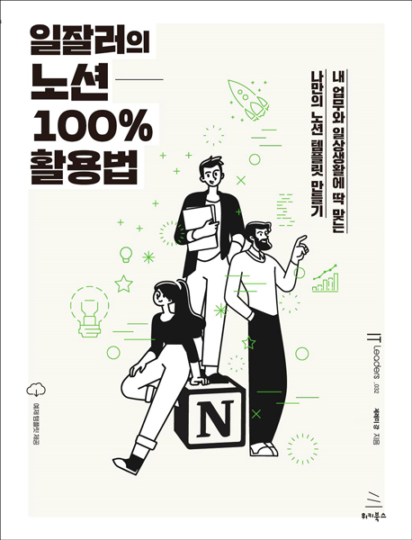

# 일잘러의 노션 100% 활용법

### 템플릿

- 6.1.1. 만능 태그와 만능 지식창고 만들기: <https://bit.ly/3l5ABTY>
- 6.1.3. 수업일정표 템플릿 완성: <https://bit.ly/3593IQV>
- 6.2.1. 만능 태그 만들기: <http://bit.ly/3nL5GO4>
- 6.2.3. 독서 감상문 템플릿 완성: <https://bit.ly/34aFBQL>
- 6.3.1. 만능 태그와 만능 지식창고 만들기: <http://bit.ly/3mFLNqn>
- 6.3.3. 출석부 템플릿 완성: <https://bit.ly/2JUX0WV>
- 7.1.3. 업무일지 템플릿 완성: <http://bit.ly/2JVAWvf>
- 7.2.3. 업무 공유 보드 템플릿 완성: <http://bit.ly/2WkyFfs>
- 7.3.3. 업무 우선순위 템플릿 완성: <http://bit.ly/2IUyrZr>
- 7.4.3. 회의록 템플릿 완성: <http://bit.ly/2LzmIQW>
- 7.5.3. 프로젝트 위키 템플릿 완성: <http://bit.ly/38i9IqS>
- 8.1.3. 운동과 음식 다이어리 템플릿 완성: <https://bit.ly/3r89WcE>
- 8.2.3. 여행 계획표 템플릿 완성: <http://bit.ly/2KyL5hg>
- 8.3.5. 블로그 템플릿 완성: <http://bit.ly/3ao4Ump>
- 8.4.4. 포트폴리오 템플릿 완성: <http://bit.ly/2WuYYzK>
